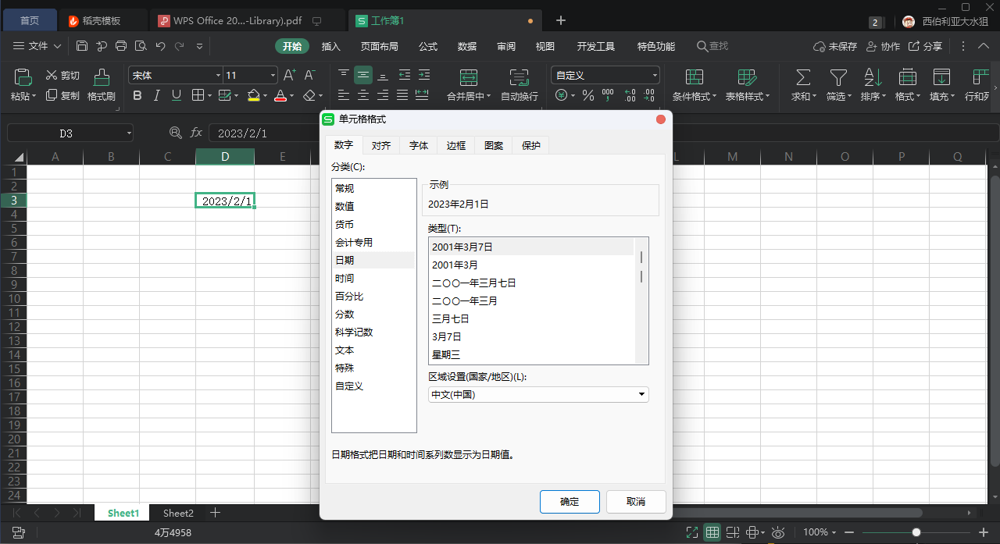
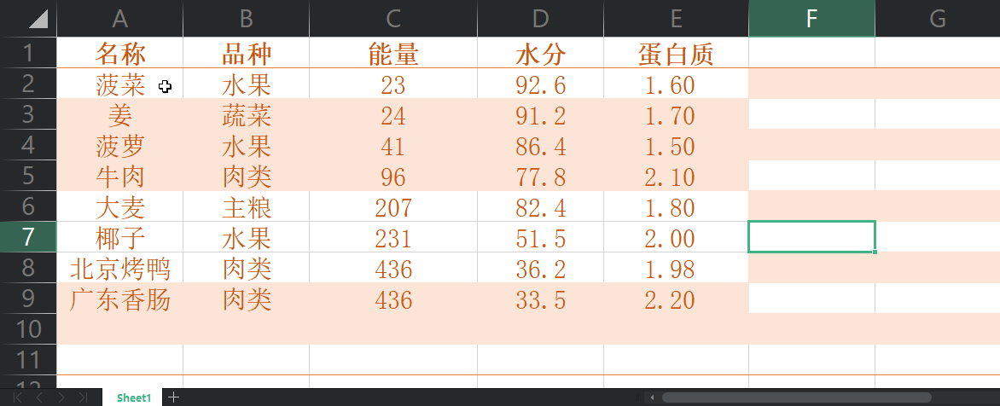
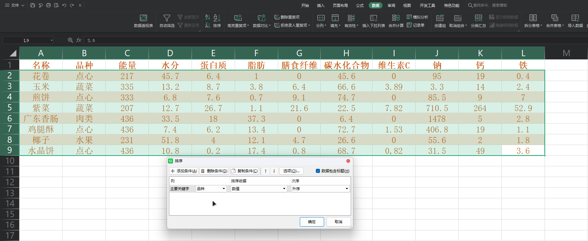
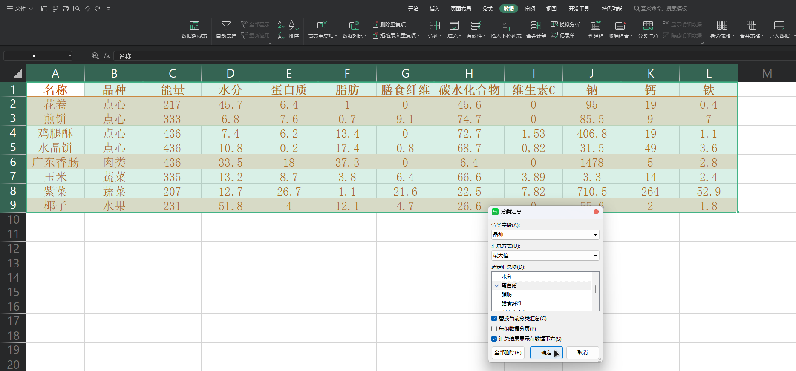

# 八年级上学期计算机资料

## 1 认识表格

表格，作为分析数据的重要工具。它清晰易懂，是相当适合我们学习的电脑技术

本章将先初识表格，在之后的几个章节中我们会讲到更高级的用法

### 1.1 软件界面

在 WPS 中，因为与 Office 一脉相承（抄袭），所以界面与 Office 的分区一样

WPS 分为 `功能区` 和 `工作表` 两个部分

**界面组成：**

|    名称    |              功能              |
| :--------: | :----------------------------: |
|  系统菜单  | 返回 WPS Office 主页的快捷方式 |
|  文件菜单  |          进行文件操作          |
| 快速工具栏 |    对文件进行快捷的常用操作    |
|   标题栏   |           显示文件名           |
| 管理工作区 |         WPS 云工作管理         |
| 设计功能区 | 包含多个选项卡，拥有大量的工具 |
|   编辑区   |   进行数据输入编辑的主要区域   |
| 视图控制区 |    对于表格大小进行缩放操作    |
|   状态栏   |        显示当前表格状态        |

### 1.2 工作表

#### 1.2.1 认识工作表

**概述：** 工作表是表格的主要编辑区域

**组成：**

|    名称    |                             功能                             |
| :--------: | :----------------------------------------------------------: |
|   名称框   |                    用于显示当前单元格名称                    |
|   编辑栏   |             输入和修改单元格数据，编辑公式和函数             |
|   单元格   |                        存放和显示数据                        |
| 列号和行号 |      列号和行号的组合即为单元格编号，列号在前，行号在后      |
| 工作表标签 | 一个工作簿可以包含多张工作表，标签可以帮助用户快速切换工作表 |

#### 1.2.2 重命名工作表

**概述：** 在实际应用中，我们可以根据实际需求对工作表进行命名。一般有以下两种方式

双击需要重命名的工作表标签，直接输入新的工作表名称

右键单击工作表标签，在快捷菜单中选择 `重命名` 命令

### 1.3 行和列

**行：** 横向的坐标。以数字从小到大排序

**列：** 纵向的坐标。以字母从左到右排序。如果超过 `Z` 则以 `AA`、`AB` 命名

### 1.4 单元格

**概述：** 工作表的行与列的交汇处叫做单元格

工作表由一个个单元格构成，单元格是存放数据的最小单元

每个单元格都有一个由行号和列表组成的专属名称

例如 B3 单元格。B3 表示该单元格位于第 B 列与第 3 行的交汇处

被选中的单元格被称为 “活动单元格”，在名称框中会显示出当前活动单元的名称（图中红色方框标识区域）

### 1.5 区域

**概述：** 由多个单元格组成的区域，每一个区域都可以用最左上角和最右下角的单元格名称表示

区域可以使用鼠标拖拽选择，在拖拽过程中会显示区域所包含的行数和列数

那么我们该如何表示区域呢？我们只需要知道区域左上角单元格和右下角单元格的名称就可以做出来

如上图，该区域的左上角单元格名称为 `A1` ，右下角单元格名称为 `C3`

则该区域名称为：`A1:C3`

::: warning 注意
冒号要使用英文冒号，不能是中文
:::

## 2 表格数据获取

### 2.1 输入文本

**概述：** 在单元格中输入数据的方式通常有三种：选择单元格输入、双击单元格输入和在编辑栏输入

::: tip 选择单元格输入

先选择自己要修改的单元格，这里以 `B3` 单元格为例。之后直接用输入法输入内容即可

:::

::: tip 双击单元格输入
先选择自己要修改的单元格，这里以 `B3` 单元格为例。之后用鼠标左键双击呈现为可输入状态即可

:::

::: tip 在编辑栏中输入
先选择自己要修改的单元格，这里以 `B3` 单元格为例。之后在编辑栏中输入文本即可

:::

### 2.2 输入日期和时间

**概述：** WPS 中规定了多种数据类型。输入的数字默认以 `常规` 方式显示，如果需要指定显示为何种格式可以通过以下方式更改

#### 2.2.1 输入日期

选中需要修改格式的单元格，输入数据（我以日期格式的数据为例）。右键在快捷菜单中选择 `设置单元格格式` 选项

在 数字 选项卡中，在分类中选择 `日期` 选项（根据需求选择），点击确定

确定后单元格中的数字应该会被更改成这种样式，显示的日期格式取决于你选择的类型

::: warning 注意

请在单元格格式选项中选择 `日期` 分类，并根据需求选择 类型

:::

#### 2.2.2 输入时间

选中需要修改格式的单元格，输入数据（随便输入一个时间）。右键在快捷菜单中选择 `设置单元格格式` 选项

在 数字 选项卡中，在分类中选择 `时间` 选项（根据需求选择），点击确定

确定后单元格中的数字应该会被更改成这种样式，显示的时间格式取决于你选择的类型

::: warning 注意

请在单元格格式选项中选择 `时间` 分类，并根据需求选择 `类型`

:::

### 2.3 快速填充数据

**概述：** 在输入数据的过程中，对于同一列中有一定规律的数据，可以使用填充柄进行快速输入。填充数据主要分两种情况：一是填充相同的数据，二是填充序列数据

#### 2.3.1 输入规律的数据

**概述：** 有规律的数据是指相互之间存在一定关系或规律的数据

使用填充柄，选择 `A2` 单元格，将光标移到单元格右下角的填充柄。光标会变为 ＋ 的形状

按住鼠标左键，拖动到所需位置

释放鼠标左键，则拖动过的区域都会显示按照规律填充的数据

WPS 会自动识别我们想要进行的填充操作，但有时会判断错误。如果你想要的是规律填充请在 `自动填充选项` 中选择 `以序列方式填充`

::: warning 注意

如果需要使用规律填充请在 `自动填充选项` 中检查是否是 `以序列方式填充`

:::

#### 2.3.2 输入相同的数据

**概述：** 填充相同数据是指在同一列数据中出现多个连续相同数据的情况

使用填充柄，选择 `C2` 单元格，将光标移到单元格右下角的填充柄。光标会变为 ＋ 的形状

按住鼠标左键，拖动到所需位置

释放鼠标左键，则拖动过的区域都会默认显示按照规律填充的数据

WPS 认为我们需要规律填充，但实际上我们需要复制填充。所以我们要在 `自动填充选项` 中选择 `复制单元格`

以上都是相当简单的操作。那么如果我们的表格有更高级的规律例如等差序列怎么办呢？

::: warning 注意

如果需要使用复制填充请在 `自动填充选项` 中检查是否是 `复制单元格`

:::

#### 2.3.3 输入等差数列

**概述：** 默认情况下 WPS 的 规律填充 都是默认为步长为 1 的数值。可在实际场景中，我们可能会遇到步长不是 1 的数列。因此我们需要给 WPS 一个识别规律的方式

选中区域，WPS 会自动识别他们之间的关系。并将光标移到右下角使用填充柄

按住鼠标左键，拖动到所需位置

释放鼠标左键，则拖动的区域会显示按照刚才选中区域的数据推测出的规律所产生的结果

::: tip 流程图

:::

### 2.4 从外部获取数据

**概述：** 在实际情况中，我们可能会从他人的文档等信息方式中获取到数据。这时为了节省时间，我们可以直接复制表格到 Excel （如果文档支持）

全选文件数据，松开鼠标

右键选中区域，选择 `复制` 选项

新建或打开表格，右键任意单元格，选择 `粘贴` 选项

导入完成后应该是这样

::: tip 流程图

:::

::: tip 提示

将数据粘贴到 Excel 可以更方便的进行高级操作。例如对表格数据进行补全

:::

## 3 表格数据处理

### 3.1 表格样式

**概述：** 当普通表格套用表格样式后，能够实现表格快速美化和列表化

全选表格数据

在开始选项卡中选择表格样式，在展开的列表中选择自己喜欢的主题

在弹出的窗口中点击确定

之后应该能看到表格样式的变化

::: tip 流程图

:::

### 3.2 数据排序

**概述：** 数据排序是指将数据列表按照一定的顺序进行排列，数据排序分为升序和降序两种方
式，排序规则包含数值大小、字母顺序、拼音顺序和笔画顺序等，还可以自定义排序方式

#### 3.2.1 简单排序

**概述：** 仅用一个关键字可以处理的数据

全选表格数据，在 `数据` 选项卡中找到 `排序` 工具

在弹出的窗口中，点击 `主要关键字` 下拉框；按需选择关键字（我以 `出生日期` 为关键字，请以实际需求选择）

次序你可以选择 `升序` 或者 `降序`。我为了显示效果选择 `降序`。请根据实际需求选择 `次序`

点击确定，应用排序规则

#### 3.2.2 同向次项排序

**概述：** 有时候筛选中需要在同等的某一种数值大小下获得尽可能多的另一种数值，同向次序或许能解决这个问题

全选表格数据，在 `数据` 选项卡中找到 `排序` 工具

在弹出的窗口中，点击 `主要关键字` 下拉框；按需选择关键字

由于我的需求是找到在同等 `能量` 中能获得尽可能多的 `蛋白质`。所以我以 `能量` 为主要关键字，`蛋白质` 为次要关键字

`次项` 选择 `升序` 即可，根据需求选择

点击确定，应用排序规则

#### 3.2.3 异向次序排序

**概述：** 有时候筛选中需要在某一种尽可能多的数值大小下获得尽可能少的另一种数值，异向次序或许能解决这个问题

全选表格数据，在 `数据` 选项卡中找到 `排序` 工具

由于我的需求是找到在尽可能多的 `蛋白质` 中获得尽可能少的 `能量`。所以我以 `蛋白质` 为主要关键字，`能量` 为次要关键字

同时，为了达成我们的筛选目的。我们要将 蛋白质 的次序设为降序（越往上越大），将 `能量` 的次序设为升序（越往上越小）

点击确定，应用排序规则

::: tip 流程图

:::

### 3.3 数据筛选

#### 3.3.1 通过单元格内容筛选

**概述：** 通过单元格内容筛选是最基本的筛选方式，用户可以制定只显示某些单元格的内容从而隐藏其他数据行

全选表格数据，如果有标题的表格则不要选中标题，只选择分类的单元格

点击 `数据` 选项卡，选择 自动筛选。此时单元格的右下角应该会显示一个黑色的下拉按钮

点击黑色下拉按钮，按需选择选项。本示例中以筛选品种为 `点心` 的食物为目标，所以勾选 `点心` 选项卡

点击 确定 按钮应用筛选条件。黑色下拉按钮 会变成 筛选按钮

::: tip 流程图

:::

#### 3.3.2 通过数值筛选

**概述：** 通过数值筛选是指筛选出满足一定数值范围的数据

启用 自动筛选 请阅读 3.3.1 的内容，本章不再赘述。现在表格是这样子

点击 黑色下拉按钮，按需选择选项。我的需求是找到所有能量为 436 的点心，所以我选择 436

点击确定按钮，应用筛选条件

::: tip 提示

为了获得需要或更精确的数据，我们可能要进行二次甚至更多次的筛选

:::

### 3.4 数据分类汇总

全选表格数据，如果有标题的表格则不要选中标题，只选择分类的单元格

点击 `数据` 选项卡，点击 `排序` 选项。弹出如下窗口

在 主要关键字 下拉框中选择品种，次序自选。之后单击 确定 应用排序

此时表格应该如图所示

在 `数据` 选项卡中点击 `分类汇总`，弹出如图所示的窗口

弹出的窗口中 `分类字段` 选择品种（以实际情况选择），`汇总方式` 选择 `平均值`（以实际情况选择），`选定汇总项` 选择 `蛋白质`（以实际情况选择），把其他默认勾选的 `汇总项` 去掉。

点击 确定 按钮，此时表格应该如图所示

**数学计算中的表达：** 2³ × 4 + 8 ÷ 4

**WPS 表格中的表达：** 2 ^ 3 * 4 + 8 / 4 

::: tip 流程图

:::

::: warning 注意

要先排序，后汇总。记得检查是否有不必要的 汇总项 

:::

## 4 表格数据计算

### 4.1 使用公式计算数据

#### 4.1.1 了解运算符

在使用公式计算数据时，运算符用于连接公式中的计算参数，是工作表处理数据的指令。运算符的类型分为 4 种

- **算术运算符（常用）：** 加号 `+`、减号 `-`、乘号 `*`、除号 `/`、百分号 `%` 以及乘方号 `^` 等
3
- **比较运算符（常用）：** 等号 `=`、大于号 `>`、小于号 `<`、小于等于号 `<=`、大于等于号 `>=` 以及不等号 `!=`

- **文本运算符（常用）：** 与号 `&`，该符号用于将两个文本值连接或串起来产生一个连续的文本值（与号 也是该类型运算符的唯一符号）

- **引用运算符（常用）：** 区域运算符 `:`、联合运算符 `,` 以及交叉运算符 ` ` （即空格）

在公式的应用中，应注意每个运算符的优先级是不同的。在一个混合运算的公式中，对于不同优先级的运算，按照从高到低的顺序进行计算。对于相同优先级的运算，按照从左到右的顺序进行计算

**数学计算中的表达：** 2³ × 4 + 8 ÷ 4

**WPS 表格中的表达：** 2 ^ 3 * 4 + 8 / 4

::: tip 提示

各种运算符的优先级（从高到低）为：冒号 `:`、空格 ` `、逗号 `,`、负号 `-`、百分号 `%`、乘方 `^`、乘号 `*` 或除号 `/`、加号 `+` 或减号 `-`、与号 `&`，以及 比较运算符 `=`、`<`、`>`、`<=`、`>=` 和 `!=`

可以通过 括号`()` 修改计算顺序
:::

#### 4.1.2 输入公式

::: tip 手动输入

**概述：** 公式可以在单元格或编辑栏中输入。输入公式都是以“=”开始的，然后再输入运算项和运算符，输入完毕按下“Enter”键后，计算结果就会显示在单元格内

选中需要显示计算结果的单元格，我的需求是在总分那里显示。所以我选择 `H2` 单元格

输入公式，注意要以等号 `=` 开头才会被识别为公式

我的需求是计算总分，所以输入 `=D2+E2+F2+G2`

按下回车，选中单元格会显示计算结果（我选择 `H2`，所以显示在 `H2`）

:::

::: tip 鼠标辅助

**概述：** 在前面介绍的输入公式的方法中，对单元格的引用为手动输入，除此之外，我们还可以通过鼠标来完成单元格的引用

选中需要显示计算结果的单元格，我的需求是在总分那里显示。所以我选择 `H2` 单元格

输入等号 `=`，单击所有需要被加在一起计算的单元格

我的需求是计算总分，因此我单击 `D2`、`E2`、`F2`、`G2`。每选择一个输入一个 `+` 号

按下回车，选中单元格会显示计算结果（我选择 `H2`，所以显示在 `H2`）

:::

::: tip 流程图

:::

#### 4.1.3 复制公式

**概述：** 在表格中输入公式后，如果想要将公式复制到其他单元格中，可以参照复制单元格数据的方法进行复制

::: tip 使用组合键复制

**概述：** 选中需要复制的公式所在的单元格，按下 `Ctrl + C` 组合键。再在需要粘贴内容的单元格按下 `Ctrl + V` 即可复制

选中需要复制公式的单元格，按下 `Ctrl + C`。被复制的单元格会显示虚线外框

选中需要粘贴内容的单元格，按下 `Ctrl + V` 即可完成公式复制

:::

::: tip 使用填充柄复制

**概述：** 选中需要复制公式的单元格，将其移到所需要的位置即可复制公式

选中需要复制公式的单元格并将光标放到单元格的右下角，光标会变为 ＋

将其往下拖到所需要的位置。我想要填完总分，因此我拖动到 H16

松开鼠标左键，此时表格应该如图所示

:::

### 4.2 单元格引用

**概述：** 单元格引用是指在公式中使用单元格的地址来代替单元格及其数据

#### 4.2.1 相对引用、绝对引用和混合引用

**概述：** 单元格引用的作用是标识工作表上的单元格或单元格区域，并知名公式中所用的数据在工作表中的位置。单元格的引用通常分为相对引用、绝对引用和混合引用。默认情况下 WPS 表格使用的是 **相对引用**

::: tip 相对引用

**概述：** 使用相对引用，单元格引用会随公式所在单元格的位置变更而改变。如在相对引用中复制公式时，公式中引用的单元格地址将被更新，指向与当前公式位置相对应的单元格

例如这张图。同样的公式被复制到了不同的位置，它的单元格引用却发生了变化

:::

::: tip 绝对引用

**概述：** 对于使用绝对引用的公式，被复制或移动到新位置后，公式中引用的单元格地址保持不变。在使用绝对引用时，需在被引用单元格的行号和列标之前分别加入符号 `$`

例如这张图。公式尽管被复制到了不同的位置，它的单元格引用却并没有发生变化。这是因为我使用 `$` 将行号和列号设为不变

:::

::: tip 混合引用

**概述：** 混合引用是指相对引用与绝对引用同时存在于一个单元格地址引用中。如果公式所在单元格的位置改变，相对引用部分会改变，而绝对引用部分不变。混合引用的使用方法与绝对引用的使用方法相似

例如这张图。同样的公式被复制到了不同的位置。与之前不同，使用了绝对引用的单元格位置地址不变，而使用了相对引用的单元格地址改变了

:::

::: tip 提示

使用 `F4` 键可使单元格地址在相对引用、绝对引用与混合引用之间进行切换（需要在编辑状态下）

:::

### 4.3 使用函数计算数据

**概述：** 在 WPS 表格中，将一组特定功能的公式组合在一起就形成了函数。利用公式可以计算一些简单的数据，而利用函数则可以很容易地完成各种复杂数据的处理工作，并简化公式的使用方法

#### 4.3.1 认识函数

**概述：** 函数是一些预定义的公式，它们使用一些称为参数的特定数值按特定的顺序或结构进行计算。熟练使用函数处理电子表格中的数据，可以节省编写公式的时间，提高工作效率

**常用的函数：**

| 函数名  |   功能   |       举例        |
| :-----: | :------: | :---------------: |
|   SUM   |   求和   |   `=SUM( A2:H2 )`   |
| AVERAGE | 求平均值 | `=AVERAGE( A2:H2 )` |
|   MAX   | 求最大值 |   `=MAX( A2:H2 )`   |
|   MIN   | 求最小值 |  `=MIN ( A2:H2 )`   |

::: tip 提示

下面的内容作为可选内容存在。如果只为了考试可以不用阅读，仅供扩展

当然，我也建议如果时间不赶的话还是阅读一下，因为它能让你更好的理解 WPS 表格中的函数

:::

##### 4.3.1.1 函数式的组成

**概述：** 一个完整的函数式主要由标识符、函数名称和函数参数组成。下面以函数式 `=SUM(D2:G2)` 为例进行介绍

- **标识符：** 在表格中输入函数式时，必须先输入 `=`。`=` 通常被称为函数的标识符

- **函数名称：** 紧跟在函数名称后面的是一对半角圆括号 `()`，被括起来的内容是函数的处理对象，即参数表。本例中，函数参数为 `D2:G2`，即 `D2` 到 `G2` 单元格区域

##### 4.3.1.2 函数参数的类型

**概述：** 函数的参数既可以是常量或公式，也可以是其他函数。常见的函数参数类型有以下几种

- **常量参数：** 主要包括文本 ( 如 `苹果`)、数值（如 `1`），以及日期（如 `2018-3-14`）等内容

- **逻辑值参数：** 主要包括逻辑真（如 `TURE`）、逻辑假（如 `FALSE`），以及逻辑判断表达式等

- **单元格引用参数：** 主要包括引用单个单元格（如 `A1`）和引用单元格区域（如 `A1:C2`）等

- **函数式：** 在 Excel 中可以使用一个函数式的返回结果作为另一个函数式的参数，这种方式称为函数嵌套，如 `=IF(A1>8," 优 ",IF(A1>6," 合格 "," 不合格 "))`

- **数组参数：** 函数参数既可以是一组常量，也可以为单元格区域的引用

::: warning 注意

当一个函数式中有多个参数时，需要用英文状态的逗号 `,` 将其隔开

:::

##### 4.3.1.3 函数的分类

**概述：** WPS 表格的函数库中提供了多种函数，在 `插入函数` 对话框中都可以查找到。按函数的功能，可以将其分为以下几类

- **文本函数：** 用来处理公式中的文本字符串。如 `TEXT` 函数可将数值转换为文本，`LOWER` 函数可将文本字符串的所有字母转换成小写形式等

- **逻辑函数：** 用来测试是否满足某个条件，并进行真假值判断。其中，`IF` 函数的使用范围非常广泛

- **日期和时间函数：** 用来分析或操作公式中与日期和时间有关的值。如 `DAY` 函数可返回以序列号表示的某日期在一个月中的天数等

- **数学和三角函数：** 用来进行数学和三角方面的计算。其中三角函数采用弧度作为角的单位，如 `RADIANS` 函数可以把角度转换为弧度等

- **财务函数：** 用来进行有关财务方面的计算。如 `DB` 函数可返回固定资产的折旧值，`IPMT` 函数可返回投资回报的利息部分等

- **统计函数：** 用来对一定范围内的数据进行统计分析。如 `MAX` 函数可返回一组数值中的最大值，`COVAR` 函数可返回协方差等

- **查找与引用函数：** 用来查找列表或表格中的指定值。如 `VLOOKUP` 函数可在表格数组的首列查找指定的值，并由此返回表格数组当前行中其他列的值等

- **数据库函数：** 主要用来对存储在数据清单中的数值进行分析，判断其是否符合特定的条件。如 `DSTDEVP` 函数可计算数据的标准偏差

- **信息函数：** 用来帮助用户鉴定单元格中的数据所属的类型或单元格是否为空等

- **工程函数：** 常用于工程分析。包括对复数进行处理、在不同的数字系统（如十进制、十六进制、八进制和二进制系统）间进行数值转换以及在不同的度量系统中进行数值转换等

#### 4.3.2 输入函数

**概述：** 在表格中输入函数的方法有多种，用户可以根据自己对函数的熟悉程度以及操作习惯选择使用

先选中需要插入函数的单元格。我需要计算总分所以选择 `H2` 单元格

点击 `fx` 按钮，弹出 `插入函数` 对话框

根据需求选择函数。我需要求和所以选择 `SUM` 函数

单击 确定 确认选择，在 函数参数 中数值按照实际情况填写。我需要计算所有分数的和所以写 `D2:G2`

单击 确认 插入函数，之后表格应该如图所示

我们有时候会遇到更麻烦的问题，需要更复杂的算式。请看下面的案例

::: tip 求去最高分和最低分的成绩

先选中需要显示成绩的单元格，我选择 `H2`

按照 4.3.2 教的方式召唤出 `插入函数` 对话框，选择 `SUM` 函数

点击确定，召唤 `函数参数` 对话框，选择 `B2:F2`，点击确定

再次双击显示成绩的单元格，输入一个 `-` 号，再次按下 `fx` 键召唤 `插入函数` 对话框

选择 `MAX` 函数，在函数参数中选择 `B2:F2`。点击确定

之后表格应该会变成这样

按照插入 `MAX` 函数的方法插入 `MIN` 函数。注意 `选择函数` 要选择 `MIN` 函数

在 `SUM` 函数和 `MIN` 函数后分别输入 `(` 和 `)`。之后在末尾输入除以 `/` 减去两位裁判后的人数：3

最后结果应该如图所示

将光标放到 `H2` 右下角召唤填充柄向下拉，表格应该如图所示

:::

## 5 用图表展现数据

**概述：** 在 WPS 表格中，可以利用图表功能，以图表的形式来表示工作表中的数据，让平面、抽象的数据变得立体、形象

**图表的组成：**

### 5.1 创建图表

**概述：** 在制作或打开一个需要创建图表的表格后，就可以开始创建图表了。在 WPS 表格中，我们经常用快捷方式创建

选中需要创建图表的数据

在 `插入` 选项卡中找到 `柱形图` 下拉框选择 `簇形柱状图`

### 5.2 编辑图表

**概述：** 创建完图表后，还需要对图表进行编辑，包括修改源数据、删除数据系列、隐藏数据系列以及添加数据标签等

点击 `图表工具` 选项卡，在 `标签` 下拉列表中选择 `图表标题` 选项

将标题更改为 `文具公司产品库存流动图`

### 5.3 美化图表

**概述：** 创建和编辑好图表后，用户可以根据自己的喜好对图表布局和样式进行设置，从而对图表进行美化

点击 `图表工具` 选项卡，在 `标签` 下拉列表中选择 `图表区` 选项

点击 `设置格式` 设置属性，选择渐变填充。按照喜好调整

### 5.4 图表类型

**概述：** WPS 表格中内置了大量的图表类型，包括柱形图、折线图、饼图、条形图、面积图、XY 散点图、股价图和雷达图等，并提供了一些常用的组合图表，方便用户根据需要选用

::: tip 柱形图
**概述：** 柱形图主要用于显示一段时间内的数据变化或各项之间的比较情况。在柱形图中，通常沿水平轴显示类别数据，即 X 轴；而沿垂直轴显示数值，即 Y 轴

柱形图包括簇状柱形图、堆积柱形图和百分比堆积柱形图 3 个图形

:::

::: tip 折线图
**概述：** 折线图可以显示随时间变化的连续数据，适用于显示在相同时间间隔下的数据趋势

如果类别标签是文本并且代表均匀分布的数值，如月、季度或财政年度，则可以使用折线图。在折线图中，类别数据沿水平轴均匀分布，数值数据沿垂直轴均匀分布

折线图包括折线图、堆积折线图、百分比堆积折线图、带数据标记的折线图、带数据标记的堆积折线图和带数据标记的百分比堆积折线图 6 个图形

:::

::: tip 饼图
**概述：** 饼图用于显示一个数据系列中各项的大小与总和的比例

相同颜色的数据标记组成一个数据系列，饼图中只有一个数据系列。饼图中的数据点显示为整个饼图的百分比，各类别分别代表整个饼图的一部分

在出现以下情况时，可以使用饼图

- 仅有一个需要绘制的数据系列

- 需要绘制的数值没有负值

- 需要绘制的数值几乎没有零值

- 类别数目不超过七个

饼图包括饼图、复合饼图、复合条饼图和圆环图 4 个图形

其中，圆环图用于显示各个部分与整体之间的关系。在圆环图中，只有排列在工作表的列或行中的数据才可以绘制到图表中

:::

::: tip 条形图

条形图用于显示各个项目之间的比较情况。在出现以下情况时可以使用条形图

- 轴标签过长

- 显示的数值是持续型的

条形图包括簇状条形图、堆积条形图和百分比堆积条形图 3 个图形

:::

::: tip 面积图

面积图用于强调数量随时间而变化的程度，也可用于引起人们对总值趋势的注意。面积图还可以通过显示所绘制的值的总和显示部分与整体的关系

面积图包括面积图、堆积面积图和百分比堆积面积图 3 个图形

:::

::: tip 散点图

XY 散点图用于显示若干数据系列中各数值之间的关系，或者将两组数据绘制为 XY 坐标的一个系列

XY 散点图通常用于显示和比较数值，如科学数据、统计数据、工程数据等

XY 散点图有两个数值轴，沿水平轴方向显示一组数值数据，即 X 轴；沿垂直轴方向显示另一组数值数据，即 Y 轴。在出现以下情况时可以使用 XY 散点图

- 需要更改水平轴的刻度
- 需要将轴的刻度转换为对数刻度
- 水平轴上有许多数据点
- 水平轴的数值不是均匀分布的
- 需要显示大型数据集之间的相似性而非数据点之间的区别
- 需要在不考虑时间的情况下比较大量数据点
- 需要有效地显示包含成对或成组数值集的工作表数据，并调整散点图的独立刻度，以显示关于成组数值的详细信息

XY 散点图包括散点图、带平滑线和数据标记的散点图、带平滑线的散点图、带直线和数据标记的散点图、带直线的散点图和气泡图 6 个图形

:::
