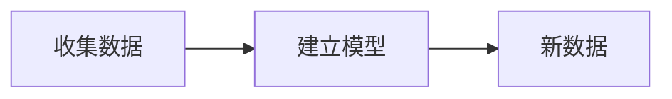
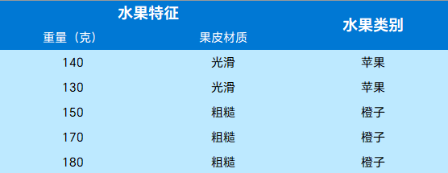

# 八年级下学期计算机资料

## 1 Python 编程基础

### 1.1 注释语句

#### 1.1.1 单行注释

**定义：** 单行的被编译器忽略的文本

**用途：** 帮助阅读代码，利于后期维护，便于理解算法

**语法：** `# 注释内容`

**示例：**

```python
# 单行注释
# 这是输出 Hello World 的代码
print("Hello World")
```

::: tip 总结
单行注释可以便捷的帮助理解一行代码，也是比较常用的注释方式
:::

#### 1.1.2 多行注释
**定义：** 可跨越多行的被编译器忽略的文本

**用途：** 书写函数批注，理解复杂算法

**语法：** `"""注释内容""" / '''注释内容''''`

**示例：**
```python
def hello_opt():
    """
    这是一个多行注释
    这个函数的用途是输出 Hello World
    不需要任何形参
    """
    print("Hello World")
```

::: tip 总结
多行注释适合处理比单行注释复杂的场景。例如一个大型项目的函数等。它的特点是可以换行处理，不一定限制在单行
:::

### 1.2 输入和输出

#### 1.2.1 输入
**定义：** 获得用户输入内容的函数

**语法：** `变量 = input( 变量 / 数据类型 /...)`

**用途：** 实际开发中需要用户提供数据实现操作的场景（例如圆的面积的计算）

**示例：** 
```python
# 这是一个输出语句
a = input("请输入：")
# 用户输入的内容会被赋值给 a，所以打印出来的是用户输入的内容（例如输入 1 就输出 1 ）
print(a)
```
`input( )` 函数中可以什么都不填，但是这样可能会导致用户以为卡死了。所以建议填入一些提示信息

`input( )` 函数会阻塞线程，就是程序到 `input( )` 这里就不动了除非用户输入数据并按下了回车
**示例2：**

```python
# 输出 Hello，此时程序正常运行
print("Hello")
# input 阻塞线程，程序在这里停止
a = input("请输入：")
# 除非用户按下回车，否则下面这段代码不会执行
print("我被执行了~")
```

需要注意的是，`input( )` 函数获得到的内容默认类型都是字符串

::: tip 总结
输入是一个很实用的函数，它是用户与程序交流的途径。使用它我们将能发掘 Python 更多强大的功能。其获得到的内容都是字符串类型
:::

#### 1.2.2 输出

**定义：** 输出是把指定内容打印到终端上的函数

**语法：** `print( 变量 / 数据类型 / ..)`

**用途：** 实际开发中需要与用户交互的场景（例如输出计算结果）

**示例：**
```python
# 定义函数 a 并赋值 Hello
a = 'Hello'
# 输出 Hello World
print("Hello World")
# 输出 a。但因为 a 的值是 Hello，所以输出 Hello
print(a)
```

事实上 `print( )` 函数有相当多的强大功能，但是碍于你们还没有学表达式，先按下不表

::: tip 总结
`print( )` 是一个功能强大的函数，它是程序与用户交流的途径，也是程序开发中最常用的函数之一
:::

### 1.3 数据类型

**定义：** 数据类型是一个值的集合和定义在这个值集上的一组操作的总称

**用途：** 存储临时数据进行操作

**数据类型：**

| 中文名 |     英文名     |  转换函数  |                             意义                             |             语法             |
| :----: | :------------: | :--------: | :----------------------------------------------------------: | :--------------------------: |
| 字符串 | `str / string` |  `str( )`  |       一般存储文字，符号等内容的数据类型。数字等也可以       | 变量 = `"字符串" / '字符串'` |
|  整数  |     `int`      |  `int( )`  | 存储整数和小数，但是小数会被去掉小数点后边的部分（不会四舍五入） |        `变量 = 整数`         |
| 浮点数 |    `float`     | `float( )` | 存储浮点数和整数，但是整数会跟上 `.0` 。例如 `float( 1 )` 就会变成 `1.0` |       `变量 = 浮点数`        |
| 布尔值 |     `bool`     | `bool( )`  |   只有两种可存储的数据：`True` 和 `False`。分别代表真和假    |    `变量 = True / False`     |
|  空值  |     `None`     |     无     |         代表什么都没有，但是不与其它任何数据类型等价         |        `变量 = None`         |

以上是 Python 中所有的数据类型表格。我会对其中的知识点进行系统的讲解

#### 1.3.1 字符串数据类型

**定义：** 一般存储文字，符号等内容的数据类型。数字等也可以

**用途：** 存储用户输入，存储输出信息

**语法：** `变量 = "字符串" / '字符串'`

**转换函数：** `str( )`

字符串是从新手期到老手都会用到的类型，也是最常用的数据类型。它的主要特点是 **占用内存大，可存储内容多** 

字符串字符串，顾名思义是存储文字的。一般来说我们把它用于输出文字信息，例如 `Hello World` ， `1` ······ 等等，1 也是字符串吗？

答案是肯定的，也许这有点违反我们的数学常识，但是我给你们解释一下就明白了

我们中国有这么多人，有人同名同姓很合理吧？现在你遇到了两个人：一个男的叫小明，另一个女的也叫小明。那你能说她们俩是一个人吗？当然不能，程序也是这样

**示例：**
```python
# 真正的整数 1
a = 1
# 字符串的 1
b = "1"
```

:::warning 注意
显示的内容相同不代表两个函数存储的内容意义相同。在这个示例中 `a` 是不等于 `b` 的
:::

那么到这里有同学就要问了，假如我想要让整数的 `1` 变成字符串的 `1`。有可能吗？

当然有！Python 为我们提供了类型转换函数，每个数据类型都有自己的类型转换函数。只要你填进的内容符合要求就可以转换

**示例2：**

```python
# 这是一个整数类型的 2
a = 2
# 这是一个字符串变量
b = ''
# 将 a 中整数类型的 2 转换为字符串类型的 2 并赋值给 b
b = str(a)
# 输出 b，此时应该是字符串类型的 b
print(b)
# 输出 b 的类型
print(type(b))
```

<Replit user="ShiYiZhiHanZhuZ" repl="Zi-Fu-Chuan-Shu-Ju-Lei-Xing-Zhuan-Huan" file="main.py" />

由于 `str` 类型的通用性，`str( )` 几乎可以转换任何数据类型。那么其它数据类型也如此吗

:::tip 总结
字符串数据类型（`str`）有着占用内存大、可存储内容多的特点。转换可以使用 `str( )` 函数转换
:::

#### 1.3.2 整数数据类型

**定义：** 存储整数和小数的数据类型

**用途：** 算法中数据的存储，计算结果的保存

**语法：** `变量 = 整数 / 小数`

**转换函数：** `int( )`

**示例：**

```python
# a 是一个整数类型的变量
a = 1
# 1 也是整数数据类型
print(1)
```
事实上你看到的所有不带 `" "` 或 `' '` 的整数都是整数数据类型

我们说过每个数据类型都有转换函数，`int` 数据类型也不例外。但它有些特别

整数数据类型和浮点数数据类型的边界比较模糊。唯一的区别就是一个专门负责处理整数，一个专门负责处理浮点数。可是浮点数可以被存储进整数数据类型里边，整数可以存储进浮点数数据类型里边

那么这样操作数据会有什么变化呢？不会 Python 就会让你无变化的进行这样子的操作造成歧义吗？

**示例2：**
```python
# 显然 a 是一个浮点数数据类型
a = 1.1
# 将 a 转换为整数并赋值给 b
b = int(a)
# b 存储的是 1，输出 1
print(b)
```

<Replit user="ShiYiZhiHanZhuZ" repl="Zheng-Shu-Shu-Ju-Lei-Xing-Zhuan-Huan" file="main.py" />

这是为什么呢？Python 为了明确职责和一些复杂的数据类型操作，会将转换浮点数为整数的结果直接把小数部分去掉，只保留整数部分并且不会四舍五入。所以 `1.1` 被保留整数部分后就是 `1`，那么 `b` 存储的当然就是 `1`

那么字符串可以转换为 `int` 数据类型吗？答案是可以，也不可以

```python
# a 是字符串数据类型的 1
a = '1'
# 将 a 的值转换为整数数据类型并赋值给 b
b = int(a)
# 输出 b，b 存储的是整数类型的 1
print(b)

# c 是字符串类型的 hello
c = 'hello'
# 将 c 的值转换为整数数据类型并赋值给 d
d = int(c)
# 报错
print(d)
```

<Replit user="ShiYiZhiHanZhuZ" repl="Zheng-Shu-Zhuan-Huan-Zi-Fu-Chuan" file="main.py" />

那么为什么字符串数据类型的 `1` 可以但是字符串数据类型的 `hello` 不可以呢？

答案显而易见，因为哪个数字是 `hello` 嘛。所以整数数据类型只能转换其它存储的是整数或小数的内容的数据类型（例如 `"2"`）

::: tip 总结
整数数据类型（`int`）是专门负责处理整数的数据类型。如果转换浮点数数据类型为整数数据类型，会只保留整数部分并且 **不会** 四舍五入。其他数据类型也可以转换为整数数据类型，前提是它存储的内容是数字
:::

#### 1.3.3  浮点数数据类型

**定义：** 存储浮点数和整数的数据类型

**用途：** 存储更精细的数据，更复杂的数据计算

**语法：** `变量 = 整数 / 小数`

**转换函数：** `float( )`

**示例：**

```python
# a 是一个浮点数数据类型的变量
a = 1.1
# 1.1 也是浮点数
print(1.1)
```

和整数一样，其实它们都是数字。唯一的区别只是有个小数点而已，也正是因为浮点数有这个小数点所以我们才叫它浮点数（理工的浪漫了属于是）

既然它也是数字，那么浮点数有什么特性呢？当然是能存储高精度的数字嘛，不同于整数数据类型只能保存整数部分，浮点数数据类型可以存储非整数部分

同样，它的转换函数也可以填入整数，那么这又会对数据本身产生什么影响呢？

**示例2：**

```python
# a 是整数数据类型的变量
a = 1
# 将 a 转换为浮点数并赋值给 b
b = float(a)
# 1 后边多了个 ".0" (1.0)
print(b)
```

同样，为了明确职责，减小歧义，Python 会对数据进行处理。如果你传入的是一个整数就会加上 `.0` 改变为浮点数

那么字符串可以转换为 `float` 数据类型吗？答案同样是可以、也不可以

```python
# a 是字符串数据类型的 1.1
a = '1.1'
# 将 a 的值转换为浮点数数据类型并赋值给 b
b = float(a)
# 输出 b，b 存储的是浮点数数据类型的 1.1
print(b)

# c 是字符串类型的 hello
c = 'hello'
# 将 c 的值转换为浮点数数据类型并赋值给 d
d = int(c)
# 报错
print(d)
```

<Replit user="ShiYiZhiHanZhuZ" repl="Fu-Dian-Shu-Zhuan-Huan" file="main.py" />

原因很简单，你也没见过是 `hello` 的浮点数嘛。同样它也可以转换其它数据类型存储内容为数字的变量

::: tip 总结
浮点数数据类型（float）是专门负责处理浮点数的数据类型。如果转换整数数据类型为浮点数数据类型，会在后面加上 `.0` 改变整数为浮点数
:::

#### 1.3.4 布尔数据类型

**定义：** 只有真（ `True` ）和假（ `False` ）的数据类型

**语法：** `变量 = True / False`

**用途：** 表达式判断，循环结构

**转换函数：** `bool( )`

**示例：**

```python
# 布尔值中的真
a = True
# 布尔值中的假
b = False
```

我们都知道计算机世界是由 2 进制构成的，事实上我们在电脑上看到的其它东西对于计算机来说都是 `0` 和 `1` 。甚至是逻辑，布尔类型就是这么个东西

布尔值只有两种，`True` 和 `False` ，分别代表真和假。它的运用很广泛，在之后的循环结构和分支结构中等等我们都会见到它。值得注意的是 `True` 和 `False` 用 `1` 和 `0` 表示也是正确的

**示例2：**

```python
a = 3
b = 2
# 判断 a 是否大于 b 。因为 a 确实大于 b，所以输出 True
print(a > b)

# 判断 5 是否小于 4 。因为 5 不小于 4，所以输出 False
print(5 < 4)
```

<Replit user="ShiYiZhiHanZhuZ" repl="Bu-Er-Shu-Ju-Lei-Xing" file="main.py" />

:::tip 总结
布尔数据类型（bool）是一种真伪判断符，只有真和假的两种状态（也许这才是计算机的模样，天真的孩子）
除了用 `True` 和 `False` 可以表示真和假之外，`1` 和 `0` 也可以
:::

#### 1.3.5 空值

**定义：** 代表空的数据类型

**语法：** `变量 = None`

**用途：** 声明变量

**示例：**

```python
# 声明变量 a
a = None
# 创建整数数据类型变量 b，并赋值 0
b = 0
# a 与 b 是否等价？
print(a == b)
# 输出 False，代表不等价
```

<Replit user="ShiYiZhiHanZhuZ" repl="Kong-Zhi" file="main.py" />

空值，顾名思义就是没有任何东西的数据类型。这个数据类型一般用于占位来声明变量。需要注意的是，因为空值本身就是一个数据类型，所以它不与 `0` 或 `" "` 等价

::: tip 总结
空值一般用于占位。由于它本身就是一个数据类型，所以不与其它数据类型中代表空的数值等价
:::

### 1.4 表达式

**定义：** 由常量，变量，运算符，小括号等按一定语法规则组成的式子

**用途：** 进行数据操作，优化输出内容，计算结果

#### 1.4.1 算数运算符

**定义：** 用于数学计算的运算符

**用途：** 数据操作

**算术运算符：**

| 运算 |  运算符  |       例子        | 结果 | 意义                                   |
| :--: | :------: | :---------------: | :--: | :------------------------------------: |
| 加法 |   `+`    |    `a = 1 + 2`    | 3    | 一个数与另一个数的加法运算求和|
| 减法 |   `-`    |    `a = 3 - 1`    | 2    | 一个数与另一个数的减法运算             |
| 乘法 |   `*`    |    `a = 3 * 4`    | 12   | 一个数与另一个数的乘法运算             |
| 除法 |   `/`    |   `a = 12 / 6`    | 2    | 一个数与另一个数的除法运算             |
| 求幂 | `a ** a` |    `a = 3 ** 2`    | 9    | 一个数与另一个数的幂运算               |
| 括号 |  `( )`   | `a = (3 + 4) * 2` | 14   | 提升运算优先级                         |
| 整除 |   `//`   |   `a = 11 // 2`   | 5    | 除不尽的取整数部分                     |
| 求余 |   `%`    |   `a = 15 % 2`    | 1    | 除不尽的取余数                         |

表达式其实就是我们数学中的运算符，所以它应该很好理解吧？但还是请同学们认真背一背符号，不要搞混了

因为其他运算比较简单，我就只讲两个比较特殊的运算

##### 1.4.1.1 整除

**定义：** 将一个数除以另一个数，然后向下取整到最接近的整数的除法

**语法：** `a = b // c`

**用途：** 做只保留整数的运算

**示例：**

```python
# 变量 a 的值是 6 整除 2 的结果
a = 6 // 2
# 输出的也是 6 整除 2 的结果
print(6 // 2)
```

<Replit user="ShiYiZhiHanZhuZ" repl="Zheng-Chu-Yun-Suan" file="main.py" />

整除整除，刚好除完嘛。但是整除有一些特殊的性质你们要知道

**示例2：**

```python
# 变量 a 的值是 5 整除 2 的结果
a = 5 // 2
# 输出 2
print(a)
```

<Replit user="ShiYiZhiHanZhuZ" repl="Zheng-Chu-De-Te-Shu-Xing-Zhi" file="main.py" />

没错，在这个示例中，5 显然不可能整除 2。那么程序运行之后为什么会输出 2 呢？我们知道，在除法中，结果有 **商** 和 **余数** 两个部分，而整除就代表只取商

这个例子中 5 除 2 显然商是 2，余数是 1。所以输出的就是 2

::: tip 总结
整除（ `//` ）中，得到的结果一定是整数，取的值是这个除法的商
:::

##### 1.4.1.2 取余

**定义：** 计算两个数相除之后的余数的除法

**语法：** `a = b % c`

**用途：** 数据操作，只需要余数的运算

**示例：**

```python
# 变量 a 的值是 5 取余 2 的结果，是 1
a = 5 % 2
# 输出的也是 5 取余 2 的结果，是 1
print(5 % 2)
```

<Replit user="ShiYiZhiHanZhuZ" repl="Qu-Yu-Yun-Suan" file="main.py" />

取余运算只会获得相除后的余数，如上面的示例一样。5 除 2 商是 2 余数是 1。所以输出 1

那么如果刚好能整除呢？

**示例2：**
```python
# 变量 a 的值是 6 取余 2 的结果
a = 6 % 2
# 输出 0
print(a)
```

<Replit user="ShiYiZhiHanZhuZ" repl="Qu-Yu-De-Te-Shu-Xing-Zhi" file="main.py" />

如果能整除那就是没有余数，那余数就是 0。在开发过程中我们通常使用这种手段判断一个数字是不是某个数字的倍数

::: tip 总结
取余运算与整除是一对好兄弟，整除运算取商，取余运算取余。如果能整除则取余 0
:::

#### 1.4.2 字符串运算符

**定义：** 实现字符串与字符串之间的操作的运算符

**用途：** 输出内容优化，字符串数据操作

**字符串运算符：**

| 运算符 |       含义       |         示例         | 意义                          |
| :----------: | :--------------: | :------------------: | ----------------------------- |
|      +       |    连接字符串    | `print("12" + "34")` | `"12" + "34"` 的值是 `"1234"` |
|      *       | 重复若干次字符串 |  `print(2 * "哈")`   | `2` * `"哈"` 的值是 `哈哈`    |

**示例：**
```python
# a 的值是 "5" 和 "2" 连接起来的样子
a = "5" + "2"
# 输出 a，结果是 "52"
print(a)

# a 的结果是 Hello 被重复六次的样子
a = 6 * "Hello"
# 输出 6 次 Hello
print(a)
```

<Replit user="ShiYiZhiHanZhuZ" repl="Zi-Fu-Chuan-Yun-Suan-Fu" file="main.py" />

### 1.5 随堂练习

你们已经迈出了走向 Python 世界的一大步。为了巩固知识，减少遗忘。我为你们提供了一套练习题，可以根据自己的需要阅览

<iframe src='https://ks.wjx.top/vm/rXYFzpD.aspx?width=795&source=iframe&s=t&tm=1&sm=t' width=100%  height='1300' frameborder='0' style='overflow:auto'></iframe>

## 2 分支结构

分支结构旨在让程序拥有思考的能力

举个例子我看到可乐。我会先看我自己有多少钱，如果有 3 元我就买，没 3 元我就不买

在程序中，如果我买那么就是 `True`，不买就是 `False`。那么我们该如何得出我买还是不买的思考结果呢？答案就是分支语句

### 2.1 条件表达式

我们首先要知道一些基础的判断逻辑

#### 2.1.1 关系运算符

**定义：** 关系运算又称为比较运算，用于对两个类型相同的表达式的值大小进行比较，其结果只能为 `True` 或 `False`

**用途：** 判断两个数的数值大小，分支结构

**关系运算符：**

| 运算符 |       含义       |         示例         | 结果                          |
| :----------: | :--------------: | :------------------: | :---------------------------: |
|      <      |    小于    | `1 < 2` | `True` |
|      <=      | 小于或等于 |  `3 + 1 <= 2 + 1`  | `False` |
| >= | 大于或等于 | `1 + 1 >= 2` | `True` |
| > | 大于 | `"a" > "b"` | `False` |
| == | 等于 | `"abc" == "ABC"` | `False` |
| != | 不等于 | `3 != 5` | `True` |

::: warning 注意
算数运算符的运算优先级 **高于** 关系运算符
:::

#### 2.1.2 逻辑运算符

**定义：** 逻辑运算又称为布尔运算，用于逻辑值进行逻辑运算

**用途：** 判断真伪，分支结构

**逻辑表达式：**

| 运算符 | 中文 | 含义                                                         |       示例        |  结果   |
| :----------: | :--------------: | :------------------: | :---------------------------: | :---------------------------: |
|  and   | 与   | 左右两边都为 `True`，其值为 `True`，否则为 `False`           | `3 < 2 and 1 > 0` | `False` |
|   or   | 或   | 左右两边都为 `False`， 其值为 `False`，否则为 `True`         | `3 < 2 or 1 > 0`  | `True`  |
|  not   | 非   | 反转布尔值结果，非 `False` 即为 `True`，非 `False` 即为 `True` |    `not 1 > 0`    | `False` |

### 2.2 分支语句

前面的内容视为对本知识点的铺垫，因为没听前面的根本听不懂后边的内容

#### 2.2.1 if 语句

**定义：** 单分支结构，如果成立就执行 `if` 后的语句，不成立则不输出

**用途：** 基础逻辑处理

**语法：**

```python
if <条件>:
    条件为真执行语句
```

**示例：**

```python
# 声明整数类型变量 a 并赋值 3
a = 3
# 声明整数类型变量 b 并赋值 5
b = 5
# 如果 a 大于 b
if a > b:
    # 不输出，因为 a 小于 b
    print("a 比 b 大")
# 没有输出内容
```

<Replit user="ShiYiZhiHanZhuZ" repl="ifYu-Ju-Shi-Li" file="main.py" />

#### 2.2.2 if else 语句

**定义：** 二分支结构，如果 `if` 内条件不成立则执行 `else` 中的语句

**用途：** 简单逻辑处理

**语法：**

```python
if <条件>:
    条件为真执行语句

else:
    条件为假执行语句
```

**示例：**

```python
# 声明整数类型变量 a 并赋值 3
a = 3
# 声明整数类型变量 b 并赋值 5
b = 5
# 如果 a 大于 b
if a > b:
    # 不输出，因为 a 小于 b
    print("a 比 b 大")
# 其它情况
else:
    # 输出，因为不满足 a 大于 b 的条件，则 a 小于 b 的情况属于其它情况
    print("a 比 b 小")
```

<Replit user="ShiYiZhiHanZhuZ" repl="ifelseYu-Ju-Shi-Li" file="main.py" />

::: warning 注意
条件表达式和 `else` 关键字后都要跟英文冒号，冒号下一条语句需要缩进，而且代码的缩进长度相等
:::

#### 2.2.3 if elif else 语句

**定义：** 多分支结构，如果 `if` 内条件不成立则判断 `elif` 语句是否成立，如果 `elif` 成立执行 `elif` 内的语句；如果 `if` 和 `elif` 都不成立执行 `else` 内的语句

**用途：** 复杂逻辑处理

**语法：**

```python
if <条件>:
    条件为真执行语句
elif <条件>:
    条件为真执行语句
···
else:
    所有 if 和 else 判断都为假执行语句
```

**示例：**

```python
# 声明整数类型变量 a 并赋值 3
a = 3
# 声明整数类型变量 b 并赋值 5
b = 5
# 如果 a 大于 b
if a > b:
    # 不输出，因为 a 小于 b
    print("a 比 b 大")

# 如果 a 等于 b
if a == b:
    # 不输出，因为 a 不等于 b
    print("a 等于 b")

# 其它情况
else:
    # 输出，因为不满足 a 大于 b 的条件，则 a 小于 b 的情况属于其它情况
    print("a 比 b 小")
```

<Replit user="ShiYiZhiHanZhuZ" repl="ifelifelseYu-Ju-Shi-Li" file="main.py" />

::: warning
如果 `if` 成立就不会执行 `elif`，如果 `elif` 成立就不会执行 `else`
`elif` 语句可以有多条，如果中间有一条成立则后边的所有语句都不执行
:::

### 2.3 随堂练习

<iframe src='https://ks.wjx.top/vm/rrxZ2DY.aspx?width=795&source=iframe&s=t&tm=1&sm=t' width=100% height='1718' frameborder='0' style='overflow:auto'></iframe>

## 3 循环结构

循环结构对于我们学习算法来说相当重要，它是我们实现一些高级操作的基础

### 3.1 for 循环

**定义：** 重复执行指定次数的循环

**语法：** `for 变量 in range(循环次数)`

**用途：** 算法

**示例：**

```python
# a 为整数类型 3
a = 3
# 重复执行 5 次
for i in range(5):
    # a 等于 a 乘 2
    a *= 2
print(a)
```

<Replit user="ShiYiZhiHanZhuZ" repl="forXun-Huan-Shi-Li" file="main.py" />

`for` 循环像一个和自己说连续不吃 3 天饭的女性，如果没满 3 天就绝不吃饭。这是一个相当有趣也固执的循环

在示例中使用的方法比较少见，因为这个是相当基础的用法。我们一般会用到更高级的方法

**高级语法：** `for 变量 in range(起始数, 结束数, 步长)`

**语法解释：**

|  名称  |      意义      |               注意                |
| :----: | :------------: | :-------------------------------: |
| 起始数 | 从什么数字开始 | 如果不填起始数，那么默认从 0 开始 |
| 结束数 | 到什么数字结束 |             必填项目              |
|  步长  |  间隔多少取值  |    如果不填步长，那么默认为 1     |

::: warning 注意
步长有特殊用法。如果步长是正数（例如 1），那么就会正向输出（0, 1, 2, 3, 4）。但如果步长和结束数是负数（例如步长 -1，结束数 -1），那么就会逆向输出（4, 3, 2, 1, 0）

输出结果的范围不包括结束数本身（因为循环到结束数就终止了，不会输出）。所以 `range(1, 10)` 的结果会是 `1, 2, ..., 9`
:::

**示例2：**

```python
# 开始值不输入的话默认从0开始，打印输出0到9
for i in range(10):
    print(i)

# 步长值不输入的话默认为1
for i in range(1, 10):
    print(i)
    # 1, 2, 3, 4, 5, 6, 7, 8, 9
    
# 步长值输入为2
for i in range(1, 10, 2):
    print(i)
   	# 1, 3, 5, 7, 9

# 打印输出10, 9, 8, 7, 6,5,4,3,2, 1, 0
for i in range(10, -1, -1):
    print(i)
```

<Replit user="ShiYiZhiHanZhuZ" repl="forXun-Huan-Shi-Li-2" file="main.py" />

各位可以发现，我们填入了一个 `i` 在 `for` 循环中，这意味着什么呢？事实上 `i` 是 `item`，代表着当前循环的值

比方说上面演示的第二种方法：`for i in range(1, 10)`。意味着 `i` 在第一次循环中代表 1,第二次循环中代表 2。以此类推

### 3.2 while 循环

**定义：** 按照特定条件执行的循环

**语法：** 

:::: code-group

::: code-group-item 条件循环
```python
while 条件:
```
:::

::: code-group-item 死循环
```python
while True:
```
:::

::::

**用途：** 需要重复执行的单线程语句

**示例：**

```python
# i 默认为整数类型 0
i = 0
# 这是一个条件循环，只有 i 小于 10 的时候才会执行
while i < 10:
    # 每循环一次 i 加 1
    i += 1
# 输出 i，i 此时应该等于 9
print(i)
```

<Replit user="ShiYiZhiHanZhuZ" repl="whileXun-Huan-Shi-Li" file="main.py" />

上面的示例是条件循环，只有当满足条件的时候才会结束。这部分的内容应该很好理解

`while` 循环就像一个不到 60 斤不会停止减肥的女性哦~

**示例2：**

```python
# 这是一个死循环，如果不干预永远不会停止
while True:
    # 输出 1
    print(1)
```

<Replit user="ShiYiZhiHanZhuZ" repl="whileXun-Huan-Shi-Li-2" file="main.py" />

上面的示例是死循环，它会从代码结尾回到开头······如果没有特殊操作永远不会停止！那么我们有办法让死循环停止吗？当然，我们需要使用 `break` 跳出循环

**示例3：**
```python
# 这是一个死循环
while True:
    # 我们给了它一个 i 小于 10 输出 1 的条件
    if i < 10:
        print(1)
    # 如果不小于 10
    else:
        # 跳出循环，这个死循环将会被终止
        break

# 因此它与下面这条语句等价
while i < 10:
    print(1)
```

<Replit user="ShiYiZhiHanZhuZ" repl="whileXun-Huan-Shi-Li-3" file="main.py" />

没错，`break` 语句让我们成功的把死循环变成了条件循环，`break` 意为跳出，你可以在不希望程序继续执行的时候使用

:::tip 总结
`while` 除非条件为假否则永远不会终止
:::

### 3.3 随堂练习

<iframe src='https://ks.wjx.top/vm/OLvcDcs.aspx?width=760&source=iframe&s=t' width=100% height='1200' frameborder='0' style='overflow:auto'></iframe>

## 4 强大的 Python 库

**定义：** 具有相关功能模块的集合

**库的种类：** Python 中有上千种由开源社区开发的优秀的第三方库。每一个库都包含特定功能的相关函数，针对不同的应用发挥不同的作用

### 4.1 库的使用

初步了解库的一些基本操作

#### 4.1.1 导入库

**语法：**

:::: code-group

::: code-group-item 导入库并赋予库别名
```python
import <库名> as <库别名>
import <库名>.<函数名> as <库别名>
```
:::

::: code-group-item 直接导入库
```python
import <库名>, <库名>.<函数名>(<函数参数>)
```
:::

::: code-group-item 导入库中全部函数
```python
from <库名> import *
from <库名> import 函数名, ..., 函数名
```
:::
::::

::: warning 注意
如果使用第一种方法，因为使用了别的名称代替了原本库的名称，所以在调用库的函数时要加上 `<库别名>` 做前缀
:::

#### 4.1.2 安装第三方库

**语法：** `pip install <库名>`

**示例：**
```shell
pip install scikit-learn
```


**示例：**

```python
# 导入 turtle 库命名为 t
import turtle as t
# 导入 time 库中的时间模块命名为 s
import time.sleep as s
```

### 4.2 random 库

**定义：** `random` 是 Python 的一种标准库，用来产生随机数

#### 4.2.1 randint 函数的使用

**定义：** 生成随机整数的函数

**用途：** 随机生成一个整数，整数 n 的范围是 `a <= n <= b`

**语法：**

```python
import random
random.randint(a, b)
```

**示例：**
```python
# 导入随机库
import random as r
# 使用随机库的生成随机整数的函数，范围是 1 ~ 100
target = r.randint(1, 100)

# 如果生成的数等于 50
if target == 50:
    # 输出等于 50
    print("等于 50")
# 如果不是 50
else:
    # 输出不是 50
    print("不是 50")
```

<Replit user="ShiYiZhiHanZhuZ" repl="randintHan-Shu-Shi-Li" file="main.py" />

::: tip 总结
`random` 库是专责生成随机数的库，而 `random.randint` 则是其中专责用来处理随机整数的库。`randint` 函数的语法是 `randint(a, b)`
:::

### 4.3 turtle 库

**定义：** `turtle` 库是 Python 中自带的画图库

**常见函数：**

|     函数     |          语法          |              作用               |
| :----------: | :--------------------: | :-----------------------------: |
|  `shape()`   |  `shape(形状关键字)`   |          改变画笔形状           |
|  `width()`   |     `width(粗细)`      |          改变画笔粗细           |
| `pencolor()` |    `pencolor(颜色)`    |          改变画笔颜色           |
|  `circle()`  |     `circle(半径)`     |    绘制半径为 `半径` 的圆形     |
|   `goto()`   | `goto(x 坐标, y 坐标)` | 将画笔移到 (`x 坐标`, `y 坐标`) |
|  `penup()`   |       `penup()`        |  抬起画笔（移动不会产生线条）   |
| `pendown()`  |      `pendown()`       |   放下画笔（移动会产生线条）    |

我们只选最为常用的函数讲解

#### 4.3.1 turtle 库的使用

`turtle` 库作为一个画图库，其底下有很多实用的函数。函数名为了方便理解，都采用了自然语言中的单词以确保简单易懂

##### 4.3.1.1 circle 函数

**定义：** `turtle` 库中专门用来画圆的函数

**用途：** 绘制图像中的圆形

**语法：** `turtle.circle(半径)`

**示例：**

```python
# 导入 turtle
import turtle as t
# 绘制一个半径为 50 像素的圆形
t.circle(50)

# 绘制一个半径为 100 像素的圆形
t.circle(100)
```

::: warning 注意
绘制半径的单位是像素，不是厘米
:::

##### 4.3.1.2 width 函数

**定义：** `turtle` 库中设置画笔大小的函数

**用途：** 根据需要改变线条宽度

**语法：** `turtle.width(线条粗细)`

**示例：**

```python
# 导入 turtle 库
import turtle as t
# 改变画笔粗细为 10
t.width(10)
# 绘制一个半径为 50 像素的圆形
t.circle(50)

# 改变画笔粗细为 20
t.width(20)
# 绘制一个半径为 100 像素的圆形
t.circle(100)
```

::: warning
笔的粗细的单位也是像素，不是厘米
:::

#### 4.3.1.3 pencolor 函数

**定义：** `turtle` 中用于改变画笔颜色的库

**用途：** 根据需要改变画笔颜色

**语法：** `turtle.pencolor("颜色")`

**示例：**

```python
# 导入 turtle
import turtle as t
# 改变画笔颜色为蓝色
t.pencolor("blue")
# 绘制一个半径为 50 像素的圆形
t.circle(50)

# 改变画笔颜色为粉色
t.pencolor("pink")
# 绘制一个半径为 100 像素的圆形
t.circle(100)
```
::: warning
`pencolor()` 函数中需填入对应颜色的英文名，不能是中文
:::

### 4.4 scikit-learn 库

Python 的强项就在于自动化和分析，本章我们将走入 Python 高级使用方式的大门

#### 4.4.1 安装 scikit-learn 库

开始之前，我们首先要安装好 `scikit-learn` 这个库才能在程序里调用它

我们只需要打开终端，输入这段命令即可（如何打开终端请看 [本地部署](/docs/document/pull.html)）

```shell
pip install scikit-learn
```

#### 4.4.2 大数据分析的一般过程



收集数据，就是根据需求寻找可能有用的信息

建立模型，就是将收集到的内容转换为程序能理解的形式

新数据，就是输入模型后得到的新内容

#### 4.4.3 收集数据和预处理



我们现在已经拿到了这些数据，下面我们要对他们进行一些基本的处理

**处理数据：**

```python
# 记录水果特征列表
features = [[140, "光滑"], [130, "光滑"], [150, "粗糙"], [170, "粗糙"], [180. "粗糙"]]
# 记录水果类别
labels = ["苹果", "苹果", "橙子", "橙子", "橙子"]
```

我们将水果特征和水果类别分别转换为列表，这样能让程序理解。但是这样就够了吗？我们知道计算机都是 0 和 1 组成的，现在 `features` 的果皮材质一项只有 `光滑` 和 `粗糙` 两种情况，我们完全可以分别使用 1 和 0 代替他们。这样会更方便程序计算

同样的，水果种类也只有 `苹果` 和 `橙子`，我们也分别用 0 和 1 表示他们

**进一步处理：**

```python
# 记录水果特征列表
features = [[140, 1], [130, 1], [150, 0], [170, 0], [180, 0]]
# 记录水果类别
labels = [0, 0, 1, 1, 1]
```

#### 4.4.4 训练模型

在训练之前，我们要先将 `scikit-learn` 库安装到 Python。命令是 `pip install scikit-learn`

那么，如何训练呢？我们首先要知道什么是 KNN 算法。事实上，KNN 是一种基本的分类和回归算法，本质上是让输入与给定的数据集进行距离计算。而 `K` 就是输入距离最近点的数量

示例
```python
from sklearn import neighbors
# 记录水果特征列表
features = [[140, 1], [130, 1], [150, 0], [170, 0], [180, 0]]
# 记录水果类别
labels = [0, 0, 1, 1, 1]

# KNN 模型芬妮系数据，K 值为 3
clf=neighbors.KNeighborsClassifier(3)
# 用我们之前收集到的数据分析训练模型
clf=clf.fit(features, labels)

# 判断 160 克重、粗糙的水果是苹果还是橙子
print(clf.predict([160, 0]))
```

<Replit user="ShiYiZhiHanZhuZ" repl="scikit-learnXun-Lian-Mo-Xing" file="main.py" />

`K` 值为 3 意味着，模型只会检查前三个邻近的数据。即 `[150, 0], [170, 0], [168, 0]`

::: warning
数据越多判断越准确，如果输出的数据有误可能是因为样本数量过少
`K` 值要酌情考虑，结合实际情况填入。如果不填 `K` 值则默认使用所有数据
:::
